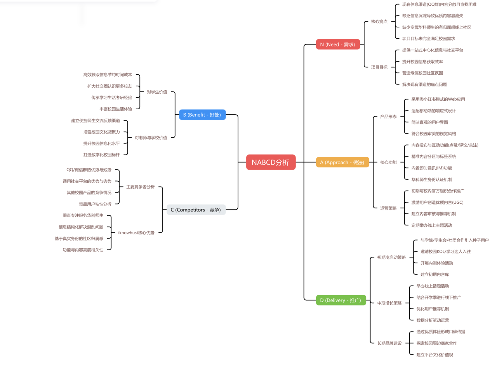

# iKnowHUST - 华科校园智能信息平台

**iKnowHUST** 是一个专为华中科技大学学生打造的校园信息聚合与智能问答平台。我们旨在解决校园信息分散、获取效率低下的问题，通过AI技术为学生提供一站式、个性化的校园生活服务。

[](https://nextjs.org/)
[](https://reactjs.org/)
[](https://firebase.google.com/)
[](https://www.typescriptlang.org/)
[](https://tailwindcss.com/)

---

## 功能特性

### 智能问答系统
- **AI驱动**: 基于Google Gemini AI大模型，提供智能校园问答服务
- **自然语言处理**: 支持自然语言查询，理解学生问题意图
- **问答历史**: 保存用户问答记录，提供个性化服务
- **问题分类**: 自动识别问题类型，提供精准回答

### 新闻信息聚合
- **多源聚合**: 整合校园官网、教务处、各院系通知
- **智能分类**: 学术、体育、校园生活等分类展示
- **实时更新**: 自动抓取最新校园资讯
- **搜索功能**: 支持关键词搜索和筛选

### 社交互动平台
- **实时聊天**: 支持一对一和群组聊天
- **消息管理**: 消息状态显示、历史记录保存
- **好友系统**: 用户社交、好友管理功能
- **社区发帖**: 内容发布、评论互动

### 现代化界面
- **响应式设计**: 完美适配桌面和移动端
- **组件化架构**: 基于Radix UI的可复用组件
- **主题系统**: 支持明暗主题切换
- **无障碍访问**: 符合WCAG标准的无障碍设计

---

## 技术栈

### 前端技术
- **框架**: Next.js 15.3.3 (App Router)
- **UI库**: React 18.3.1 + Radix UI
- **样式**: Tailwind CSS + CSS Modules
- **状态管理**: React Context + Hooks
- **类型检查**: TypeScript 5.0

### 后端服务
- **数据库**: Firebase Firestore
- **认证**: Firebase Authentication
- **存储**: Firebase Storage
- **AI服务**: Google Gemini AI (Genkit)
- **实时通信**: Firebase Realtime Database

### 开发工具
- **包管理**: npm
- **代码规范**: ESLint + Prettier
- **版本控制**: Git
- **部署**: Vercel (推荐)

---

## 快速开始

### 环境要求
- Node.js 18.0.0 或更高版本
- npm 8.0.0 或更高版本
- Git

### 安装步骤

1. **克隆项目**
   ```bash
   git clone https://gitee.com/abigpigishere/hust_se_project.git
   cd hust_se_project/code
   ```

2. **安装依赖**
   ```bash
   npm install
   ```

3. **配置环境变量**
   
   在 `code` 目录下创建 `.env.local` 文件：
   ```bash
   # Firebase 配置
   NEXT_PUBLIC_FIREBASE_API_KEY=your_api_key
   NEXT_PUBLIC_FIREBASE_AUTH_DOMAIN=your_auth_domain
   NEXT_PUBLIC_FIREBASE_PROJECT_ID=your_project_id
   NEXT_PUBLIC_FIREBASE_STORAGE_BUCKET=your_storage_bucket
   NEXT_PUBLIC_FIREBASE_MESSAGING_SENDER_ID=your_sender_id
   NEXT_PUBLIC_FIREBASE_APP_ID=your_app_id
   
   # Google AI 配置
   GEMINI_API_KEY=your_gemini_api_key

   # 华中大 AI 问答代理配置
   # 若未提供，服务将无法访问校内 AI 接口
   HUST_AI_API_URL=https://ai.hust.edu.cn/proxy/chatai-session/agent/sseProxy/chat_query
   HUST_AI_APP_ID=143
   HUST_AI_BEARER_TOKEN=your_portal_bearer_token
   HUST_AI_COOKIE=BIGipServerpool-wxb-aiportal=...; SESSION=...
   HUST_AI_REFERER=https://ai.hust.edu.cn/chat/bots/hust-bot
   HUST_AI_DEFAULT_USER_ID=portal_your_student_id
   HUST_AI_DEFAULT_CONVERSATION_ID=d3tj2pm60uuv4qighitg
   ```

   > **提示**：服务端会固定使用 `HUST_AI_DEFAULT_USER_ID` 与华中大 AI 服务通信，以匹配凭证身份，前端传入的 `userId` 将被忽略。

   > **安全提示**: `HUST_AI_BEARER_TOKEN` 与 `HUST_AI_COOKIE` 均属于敏感凭证，请务必仅在本地 `.env.local` 中配置，切勿提交到版本库。

4. **运行开发服务器**
   ```bash
   npm run dev
   ```
   
   访问 [http://localhost:9002](http://localhost:9002) 查看应用

### 多标签页同时登录不同账号

项目现已默认使用 **浏览器会话级别的 Firebase Auth 持久化**。这意味着：

- 同一浏览器中打开多个标签页时，每个标签页都可以独立登录不同账号；
- 刷新标签页不会丢失当前登录状态，但关闭标签页或浏览器后会话即被清除；
- 如果需要恢复原先“全局共享登录状态”的行为，可在自定义构建中将 `code/src/firebase/index.ts` 中的持久化策略改回 `browserLocalPersistence`。

对于需要同时运营多个账号（如测试或运营场景）而言，只需在不同标签页或浏览器窗口中访问应用并分别登录即可，无需额外配置。

### 可用脚本

```bash
# 开发模式
npm run dev

# 构建生产版本
npm run build

# 启动生产服务器
npm run start

# 代码检查
npm run lint

# 类型检查
npm run typecheck

# AI开发模式
npm run genkit:dev
```

---

## 团队成员

| 姓名 | 学号 | 角色 | 主要职责 |
|------|------|------|----------|
| **陈戈*** | U202315681 | 队长 & 架构/后端负责人 | 系统架构设计、后端开发、项目管理 |
| **赵煦** | U202315713 | 前端核心功能开发 | 前端核心功能实现、用户界面开发 |
| **陈永琪** | U202315682 | 前端组件与UI/UX & 测试 | UI组件开发、用户体验设计、系统测试 |
| **胡智涵** | U202315687 | AI功能 & 后端 | AI功能开发、后端服务、数据处理 |

---

## 项目结构

```
hust_se_project/
├── code/                           # 项目源代码 (Next.js 应用)
│   ├── src/                        # 主要源代码目录
│   │   ├── app/                    # Next.js App Router, 页面和路由
│   │   │   ├── (app)/              # 应用页面组
│   │   │   │   ├── admin/          # 管理员页面
│   │   │   │   ├── chat/           # 聊天功能页面
│   │   │   │   ├── community/     # 社区页面
│   │   │   │   ├── news/          # 新闻页面
│   │   │   │   ├── post/          # 发帖页面
│   │   │   │   ├── profile/       # 用户资料页面
│   │   │   │   └── social/        # 社交页面
│   │   │   └── login/              # 登录页面
│   │   ├── components/             # 可复用的React组件
│   │   │   ├── ui/                 # 基础UI组件
│   │   │   └── layout/             # 布局组件
│   │   ├── firebase/               # Firebase相关配置和逻辑
│   │   ├── hooks/                  # 自定义React Hooks
│   │   ├── lib/                    # 公共函数和工具库
│   │   └── ai/                     # AI功能相关代码
│   ├── public/                     # 静态资源
│   ├── package.json                # 项目依赖和脚本
│   ├── next.config.ts              # Next.js 配置文件
│   ├── tailwind.config.ts          # Tailwind CSS 配置
│   └── tsconfig.json               # TypeScript 配置
├── docs/                           # 项目文档
│   ├── 软件设计报告.md             # 系统设计文档
│   ├── 需求规格说明报告.md         # 需求分析文档
│   ├── 项目任务分解总表_7周.md     # 项目管理文档
│   └── NABCD.md                    # NABCD分析文档
├── images/                         # 项目图片资源
│   └── NABCD分析.png               # NABCD分析思维导图
├── .gitignore                      # Git忽略配置
└── README.md                       # 项目说明文件
```

---

## 项目文档

### 核心文档
- **[软件设计报告](./docs/软件设计报告.md)** - 详细的系统架构和设计文档
- **[需求规格说明报告](./docs/需求规格说明报告.md)** - 完整的功能需求和非功能需求
- **[项目任务分解总表](./docs/项目任务分解总表_7周.md)** - 7周项目计划和任务分配
- **[NABCD分析](./docs/NABCD.md)** - 项目需求分析思维导图

### 项目特色
- **现代化技术栈**: Next.js 15 + React 18 + TypeScript
- **AI智能集成**: Google Gemini AI 驱动的智能问答
- **实时通信**: Firebase 实时数据库支持
- **响应式设计**: 完美适配各种设备
- **组件化架构**: 高度可复用的UI组件

---

## 部署指南

### 本地开发
```bash
# 克隆项目
git clone https://gitee.com/abigpigishere/hust_se_project.git
cd hust_se_project/code

# 安装依赖
npm install

# 配置环境变量
cp .env.example .env.local

# 启动开发服务器
npm run dev
```

### 生产部署
```bash
# 构建生产版本
npm run build

# 启动生产服务器
npm run start
```

### 推荐部署平台
- **Vercel**: 最佳Next.js部署平台
- **Netlify**: 静态站点部署
- **Firebase Hosting**: 与Firebase服务集成

---

## 贡献指南

1. Fork 本仓库
2. 创建特性分支 (`git checkout -b feature/AmazingFeature`)
3. 提交更改 (`git commit -m 'Add some AmazingFeature'`)
4. 推送到分支 (`git push origin feature/AmazingFeature`)
5. 打开 Pull Request

---

## 许可证

本项目采用 MIT 许可证 - 查看 [LICENSE](LICENSE) 文件了解详情

---

## 联系我们

- **项目地址**: [https://gitee.com/abigpigishere/hust_se_project](https://gitee.com/abigpigishere/hust_se_project)
- **问题反馈**: 请在 Issues 中提交问题
- **功能建议**: 欢迎提交 Feature Request

---

## iKnowHUST 项目 NABCD 分析

下面是我们项目的 NABCD 分析思维导图：



---

<div align="center">

**如果这个项目对您有帮助，请给我们一个 Star！**

Made with ❤️ by iKnowHUST Team

</div>
